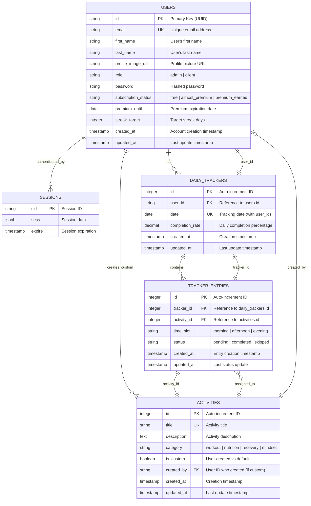

# Transcend Your Body - Daily Tracker: Entity Relationship Diagram

## Database Schema Overview

This document outlines the complete database schema for the Transcend Your Body daily activity tracking application, including all entities, relationships, and business logic with progress tracking attributes.

## Database Schema and Relationships



## Key Features & Business Logic

### 1. User Management
- **Authentication**: Session-based auth with Passport.js
- **Role-based Access**: Admin vs Client permissions
- **Subscription Logic**: Dynamic premium status based on engagement

### 2. Activity Tracking System
- **Time-based Structure**: Morning, Afternoon, Evening slots
- **Category Organization**: 4 wellness dimensions (workout, nutrition, recovery, mindset)
- **Status Tracking**: pending → completed/skipped lifecycle

### 3. Progress & Gamification
- **Daily Streaks**: Consecutive days with completed activities
- **Achievement Levels**: Beginner → Starter → Intermediate → Advanced → Expert → Master
- **Subscription Tiers**: Free → Almost Premium → Premium Earned

### 4. Data Relationships

#### Primary Flows:
1. **User Registration** → Creates user record with default 'client' role
2. **Daily Access** → Auto-creates daily_tracker for current date
3. **Activity Assignment** → Creates tracker_entries linked to daily_tracker
4. **Completion Tracking** → Updates entry status and recalculates completion_rate
5. **Progress Calculation** → Analyzes streaks and totals for subscription status

#### Key Constraints:
- One daily_tracker per user per date (unique constraint)
- Users can only modify their own activities (except admins)
- Custom activities are user-specific
- Session management for authentication state

### 5. Subscription Logic Algorithm

```javascript
function calculateSubscriptionStatus(streak, totalActivities) {
    if (streak >= 7 || totalActivities >= 10) {
        return 'premium_earned';
    } else if (streak >= 3 || totalActivities >= 7) {
        return 'almost_premium';  
    } else {
        return 'free';
    }
}
```

### 6. Streak Calculation Logic

```sql
-- Calculates consecutive days with activities from today backwards
WITH RECURSIVE streak_days AS (
    SELECT user_id, date, completion_rate, 1 as streak_length
    FROM daily_trackers 
    WHERE date = CURRENT_DATE AND completion_rate > 0
    
    UNION ALL
    
    SELECT dt.user_id, dt.date, dt.completion_rate, sd.streak_length + 1
    FROM daily_trackers dt
    JOIN streak_days sd ON dt.user_id = sd.user_id 
        AND dt.date = sd.date - INTERVAL '1 day'
    WHERE dt.completion_rate > 0
)
SELECT user_id, MAX(streak_length) as current_streak 
FROM streak_days 
GROUP BY user_id;
```

## Technical Stack
- **Backend**: Node.js, Express, TypeScript
- **Database**: PostgreSQL with Drizzle ORM
- **Frontend**: EJS templates, Bootstrap, Vanilla JavaScript
- **Authentication**: Passport.js with local strategy
- **Session Store**: PostgreSQL-based session management

## Deployment Notes
- Environment variables for database connection
- Session secret for authentication security
- Role-based route protection
- Real-time stats updates via API endpoints